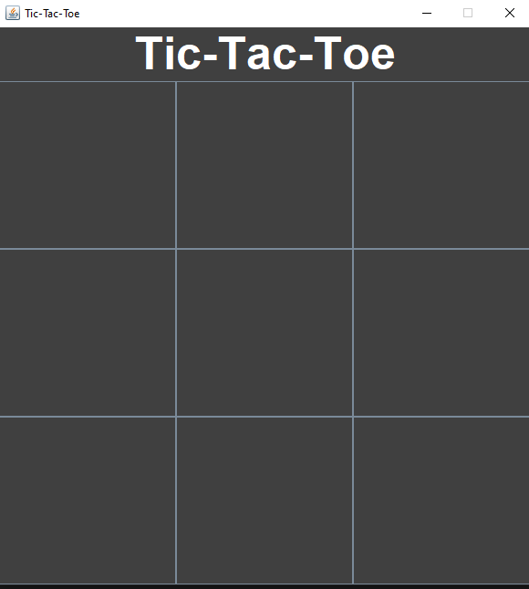
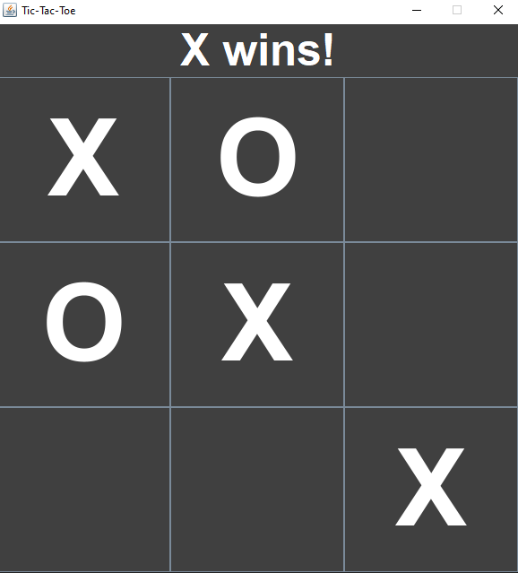

🎮Tic-Tac-Toe Game in Java

A simple and interactive Tic-Tac-Toe Game developed using Java Swing. This project allows two players to play the classic game on a 3×3 grid with automatic winner and draw detection.

---

⭐ Features

✨ User-Friendly Graphical Interface (GUI)

✨ Two-Player Gameplay

✨ Automatic Turn Switching

✨ Winner Detection (Rows, Columns & Diagonals)

✨ Draw Detection

✨ Responsive Button-Based Game Board

✨ Real-Time Game Status Updates

---

🛠️Technologies Used

- Java
- Java Swing
- AWT Event Handling
- Object-Oriented Programming (OOP)

---

📂 Project Structure

TicTacToe/
│
├── TicTacToe.java
├── README.md
└── Screenshots/
    ├── Output1.png
    └── Output2.png

---

🚀 How to Run

Step 1: Compile the Program

javac TicTacToe.java

Step 2: Run the Program

java TicTacToe

---

🎯 Game Rules

⭐ Player X starts the game.

⭐ Players take turns selecting an empty cell.

⭐ The first player to align three symbols horizontally, vertically, or diagonally wins.

⭐ If all cells are filled and no winner is found, the game ends in a draw.

---

📸 Screenshots

Game Board

Winner / Draw Result

---

📚 Learning Outcomes

✔ Java Swing GUI Development

✔ Event-Driven Programming

✔ Layout Management

✔ Game Logic Implementation

✔ Object-Oriented Design Concepts

---

👨‍💻 Author

Swatishree Padhiary

---

License

This project is created for educational and learning purpose.
